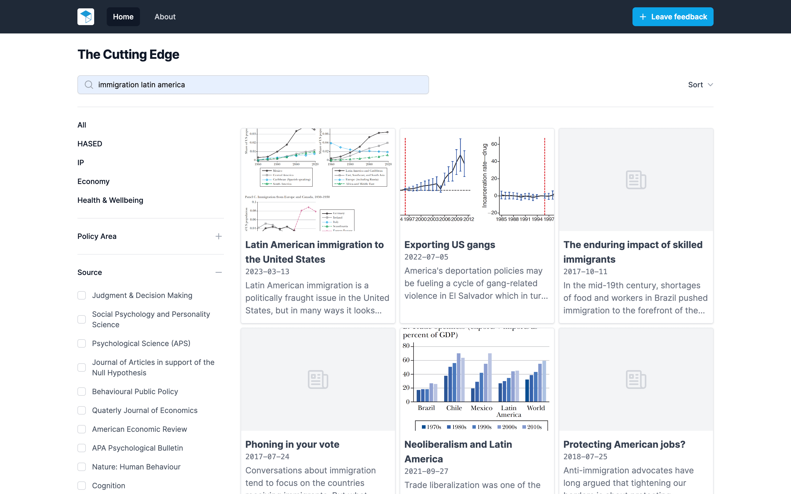

# About the BIT Cutting Edge prototype

This is a prototype of a tool developed with Hannah B to investigate whether
LLMs can help BIT's teams stay up-to-date with the latest news and research.

The tool pulls in previews of academic papers from 20+ journals and categorises
them according to 20+ policy areas, spanning BIT's four clusters. The tool could
be extended to provide summaries of individual papers, or reader digests for a
group of papers e.g. "Summarise all research in social care from the last
month."

Being a rough prototype, there is much that can be improved.

For more in-depth technical explanation, see [./README.md](./README.md)

## Sources (academic journals)

The tool shows article previews pulled from the RSS feeds of the journals listed
on this page:

https://cutting-edge.worthwhile.app/sources

The list can be updated by editing `SOURCES` in the file
[./scripts/seed.ts](./scripts/seed.ts) before running the script.

Current sources are relatively low volume (mostly less than 10 articles per
month per journal), and pulling in new articles is done manually (instructions
in [./README.md](./README.md)). It wouldn't be much work to automate this with a
cronjob e.g. hourly or daily, see
[#ideas-for-future-development](#ideas-for-future-development).

## Categorising articles according to topic

The tool labels new articles coming in as belonging to one of the following
policy areas:

https://cutting-edge.worthwhile.app/topics

The list can be updated by editing `TOPICS` in the file
[./scripts/seed.ts](./scripts/seed.ts) before running the script.

We explored two methods of categorisation:

### 1. Zero-shot classification

This is low effort and more expensive than the other option - although still
cheap, currently ~$1 to categorise 100 articles using OpenAI's GPT4. Accuracy
depends on the complexity of the categories, but is generally pretty good and
will only get better with each new generation of advanced LLM.

Categorisation is triggered by manually running a script (instructions in
[./README.md](./README.md)).

### 2. Embedding similarity classification

If zero-shot classification with an advanced LLM isn't doing a good enough job
for your topics, or if it proves too costly, we can instead create training data
by manually labelling articles using this tool:

https://cutting-edge.worthwhile.app/label

By converting the article previews to vector embeddings, we can calculate the
average embedding for each topic, and categorise new articles coming in by
choosing the topic with the closest embedding. This requires some human time in
labelling articles (and re-labelling whenever the topics change), but could lead
to higher accuracy than zero-shot, and is very cheap computationally.

## Search

We implemented a basic semantic search over the article titles and descriptions
using embedding similarity. This type of search is capable of finding matches
which are semantically similar to the search term, without necessarily
containing the same words. The accuracy of the search functionality would be
improved by cleaning up the article preview data, which is variable in length
between sources, and sometimes erroneous.

## Feedback

We solicited feedback from colleagues through this form:

https://cutting-edge.worthwhile.app/feedback

Results are shown on this page:

https://cutting-edge.worthwhile.app/feedback/results

Here's a one paragraph summary of the feedback (written by Claude):

> Overall the platform shows promise as a useful tool for staying updated on
> latest research, though further refinements could enhance utility -
> suggestions include improving search functionality; formatting adjustments
> like more visible titles/abstracts; additional filters and sorts (e.g. date);
> streamlining categories; quality cues like upvoting; supplementation in the
> newsletter; and minor technical fixes. While some current aspects may
> replicate existing databases, features tailored to BIT interests could set
> this apart as uniquely valuable.

## Ideas for future development

- Review the current RSS feed sources to understand the quality and volume of
  data better
- Clean up the article data (address any bugs from particular sources, limit
  description length)
- Review the topics, and consider allowing multiple topics per article
  (currently only allowed one)
- Add functionality for users to confirm or edit the AI's labels
- Consider whether it would be viable for a human to label all new articles,
  given the low volume
- Create a cronjob to automatically run the "pull" and "classify" scripts hourly
  / daily
- Create a script to classify articles with embedding similarity using labelled
  training data (to compare with zero-shot)
- Add functionality to allow non-RSS feed sources (create RSS sources ourselves
  using cheerio scraper + rss writer + cache result at an endpoint e.g.
  `/api/rss/economist`)
- Add functionality to create AI-written summaries of articles (or a list of
  multiple articles)
- Add filter for article publish date to the web interface
- Add results pagination
- Rate limit search queries
- Improve the url query string state management
